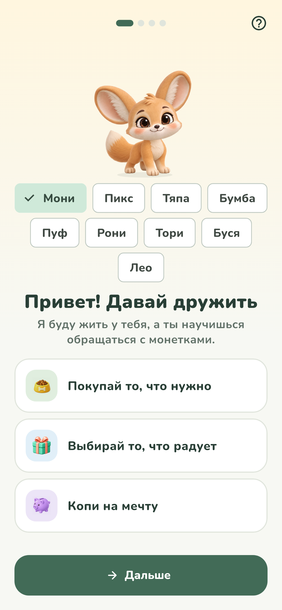
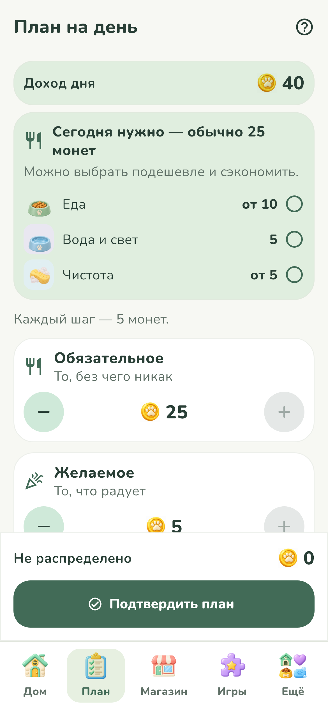
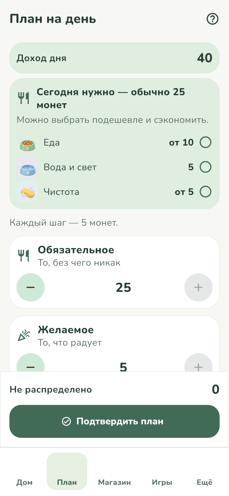

# Питомец Финни

Игровое приложение по финансовой грамотности для детей 7–11 лет. Ребёнок заводит питомца и каждый день сам распоряжается его монетами: раскладывает доход по плану, покупает нужное и желаемое, копит на мечту, играет в финансовые игры и решает жизненные ситуации. От этих решений зависят шкалы питомца и то, как он растёт. После каждого действия приложение коротко объясняет, что изменилось и почему.

Приложение полностью локальное: нет сервера, аккаунта, рекламы, реальных платежей и ни одного разрешения Android. Монеты игровые и ни во что не обмениваются.

Команда StepApp · «Лидеры цифровой трансформации 2026» · задача Департамента финансов города Москвы.

## Ссылки

| Что | Где |
| --- | --- |
| Готовый APK | [GitHub Releases](https://github.com/stepApp-su/LCT2026-stepapp/releases) → последняя «Сборка N», файл `finni.apk` |
| Тестовый стенд | https://lct2026.stepapp.su — веб-версия со сценариями для экспертов, сбросом и кнопкой «Скачать APK» |
| Репозиторий | https://github.com/stepApp-su/LCT2026-stepapp |

## Скриншоты

| Создание питомца | Главный экран | План дня |
| --- | --- | --- |
|  |  |  |

## Стек и сборка

| Параметр | Значение |
| --- | --- |
| Платформа | Flutter 3.47.5 (stable), Dart 3.12+ |
| Библиотеки | `shared_preferences` (профиль на устройстве), `audioplayers` (звук), `flutter_svg` (графика) |
| Проверки | `flutter_lints`, `import_lint` (домен не зависит от Flutter), `flutter_test` |
| Android | 8.0 и выше: minSdk 26, targetSdk 36, только портретная ориентация, от 360 dp |
| Пакет | `ru.stepapp.finni`, версия 1.0.0 (`pubspec.yaml`), номер сборки в CI — номер запуска GitHub Actions |
| Разрешения | Ноль. В манифесте `tools:node="removeAll"`, CI проверяет готовый APK через `aapt` |

### Что установить

- Flutter 3.47.5 (stable) — Dart идёт в комплекте;
- JDK 17;
- Android SDK с платформой 36 (через Android Studio или `sdkmanager`).

`flutter doctor` не должен показывать ошибок в разделах Flutter и Android toolchain.

### Быстрый запуск

```bash
git clone https://github.com/stepApp-su/LCT2026-stepapp.git
cd LCT2026-stepapp
flutter pub get
flutter run                          # приложение на телефоне или эмуляторе
flutter run -t lib/main_stand.dart   # тестовый стенд
```

### Проверки (то же делает CI)

```bash
dart run import_lint
flutter analyze
flutter test
```

### Релизный APK

```bash
flutter build apk --release          # build/app/outputs/flutter-apk/app-release.apk
flutter build appbundle --release    # AAB: build/app/outputs/bundle/release/
```

APK ставится на телефон без среды разработки (нужно разрешить установку из неизвестных источников).

Ключей подписи в репозитории нет: `*.jks`, `*.keystore` и `key.properties` в `.gitignore`. В CI ключ команды берётся из секрета `FINNI_ANDROID_KEYSTORE`, поэтому все сборки из Releases ставятся поверх друг друга. Локальная сборка подписывается отладочным ключом Android SDK — перед установкой удалите версию из Releases.

### Тестовый стенд

```bash
flutter build web --release --target lib/main_stand.dart   # результат в build/web
```

## Что где лежит

| Путь | Что там |
| --- | --- |
| `lib/domain` | Вся бизнес-логика на чистом Dart: кошелёк, план, магазин, мечта, питомец, рост, звания, игры, уровни, события дня |
| `lib/content` | Загрузка и проверка JSON-контента |
| `lib/data` | Сохранение профиля на устройстве, звук |
| `lib/ui` | Экраны, игры, виджеты и `GameController`, который связывает экраны с доменом |
| `lib/stand` | Тестовый стенд для экспертов |
| `assets/content` | Учебный контент и параметры экономики |
| `assets/pets`, `assets/room`, `assets/images`, `assets/audio`, `assets/fonts` | Графика, звук, шрифт Nunito |
| `test` | Автотесты: домен, контент, сохранение, сквозные сценарии, виджеты |
| `.github/workflows/ci.yml` | Линт, анализ, тесты, сборка и подпись APK, проверка разрешений, стенд, релиз |
| `deploy` | Публикация стенда (статика через nginx) |

## Архитектура

```
Экраны и игры (lib/ui)
        │  только вызывают методы и читают состояние
GameController ── сохраняет профиль после каждого действия
        │
Доменные сервисы (lib/domain/services, чистый Dart)
   Wallet · Plan · Shop · Goal · PetState · Growth · Title
   TaskEngine · Hint · Level · DayEventPicker · DaySummary · Phrase
        │  читают
assets/content/*.json ──► ContentRepository (проверка при загрузке)
shared_preferences ──► профиль, ключ finni_game_v1
```

- **Серверной части нет.** Для прототипа она не нужна, а профиль хранится только на устройстве — так приложение не собирает и не передаёт никаких данных. Сервер `lct2026.stepapp.su` только раздаёт стенд и APK, приложение к нему не обращается.
- **Логика отделена от интерфейса.** `lib/domain` не может импортировать Flutter — это проверяет `import_lint` в CI.
- **Контент отделён от кода.** Тексты, цены, награды, задания и события лежат в JSON.
- **Время — через один сервис.** `GameClock` единственный читает текущее время (за этим следит тест `no_direct_datetime_test`), в демо-режиме его заменяет `DemoClock`.
- **Игровой день** заканчивается, когда ребёнок нажимает «Спокойной ночи», а не по часам. Поэтому весь сценарий проходится подряд, без ожидания.

## Данные

**Профиль** — одна JSON-запись в `shared_preferences` (ключ `finni_game_v1`): номер дня, питомец и его игровое имя, шкалы, баланс и копилка, план дня, журнал операций, мечта, покупки, прогресс в играх и уровнях, история дней, звания, настройки. Персональных полей нет — это проверяет отдельный тест.

**Контент** — `assets/content`:

| Файл | Что задаёт |
| --- | --- |
| `economy.json` | Доход дня (40), шаг плана (5), стартовые шкалы, нужды питомца, ночные изменения, очки роста и пороги стадий, расписание событий |
| `tasks.json` | 16 игр по трём темам, 11 типов механик, варианты для тренировки, уровней и задания дня |
| `levels.json` | Зарплата уровней, открытие игр, награды задания дня |
| `shop.json` | 46 товаров: 15 обязательных, 31 желаемый |
| `goals.json` | 18 мечт |
| `titles.json` | 9 званий |
| `events.json` | 21 событие дня |
| `glossary.json` | Словарик: 30 терминов |
| `competences.json` | 23 компетенции Единой рамки, на которые ссылается весь контент |
| `phrases.json`, `coach.json`, `summaries.json` | Реплики питомца, обучение, тексты итогов дня |

**Как добавить задание.** Добавить запись в `tasks.json` с существующим типом механики (и строку в `levels.json`, если нужен уровень открытия). При загрузке запись проверяется: ссылки на тему и компетенции, оба объяснения, пустые тексты, стоп-слова. Запись с ошибкой пропускается и не роняет приложение. Код менять не нужно.

## Главные правила игры

- Каждое утро в план попадают все монеты кошелька: 40 на новый день и всё, что осталось со вчера. План делится на «Обязательное», «Желаемое» и «Копилку» шагом 5, сумма не больше дохода, остаток виден всегда.
- Монеты, заработанные днём (игры уровня, задание дня, события), попадают в кармашек «Новые монеты»: их можно отложить в копилку или потратить на нужное, а остаток переходит в план завтра.
- За игру уровня — столько монет, сколько звёзд (до 3). Задание дня: 12 / 8 / 5 монет в зависимости от попыток. Свободная тренировка монет не даёт.
- Купить дороже баланса нельзя: приложение объясняет почему и предлагает варианты. Минуса не бывает.
- За ночь шкалы снижаются (сытость −35, чистота −25, радость −12), покупки их восстанавливают. У шкал нижняя граница 10: питомец не болеет от ошибок.
- Очки роста: всё нужное куплено +2, траты по плану +2, отложено по плану +2, задание сделано +1. Стадии: яйцо → малыш (4) → подросток (14) → взрослый (32), назад не откатываются.
- Срок до мечты = остаток ÷ среднее пополнение за последние дни, с округлением вверх.

Полные формулы — в сопроводительной документации, раздел 6.

## Демонстрационный сценарий

1. Первый запуск: знакомство с тремя решениями, выбор питомца и имени, мечта.
2. План дня: разложить монеты, подтвердить.
3. Игры уровня: пройти одну игру верно, другую — с ошибкой. Объяснение есть в обоих случаях.
4. Магазин: купить нужное и желаемое, попробовать купить то, на что не хватает.
5. Копилка: пополнить, посмотреть срок до мечты.
6. «Спокойной ночи» → итоги дня: план против факта, изменения шкал с причинами. Повторить несколько дней — питомец растёт.
7. Закрыть и открыть приложение — всё сохранилось.
8. «Ещё» → «Для взрослого» → решить пример → «Начать заново» или «Удалить профиль».

Чтобы сразу открыть все игры, товары и мечты, включите «Ещё» → «Для взрослого» → «Демо-режим».

На тестовом стенде есть готовые сценарии (профили «разумный игрок» и «транжира», нужные дни и события) и кнопка «Сбросить».

## Реализованные требования

| Требование ТЗ | Статус | Где проверить |
| --- | --- | --- |
| 2.5.1 Знакомство, гостевой режим, подсказка в любой момент | реализовано | `welcome_screen.dart`, кнопка «?», `coach.json`; `game_integration_test` |
| 2.5.2 Внешний вид и имя питомца | реализовано | 9 питомцев и одежда; `pet_selection_test` |
| 2.5.3 Главный экран: питомец, баланс, копилка, мечта, шкалы, задание | реализовано | `game_shell.dart`; тест на 360 dp |
| 2.5.4 Игровая валюта, источник и сумма каждого начисления | реализовано | `WalletService`, дневник; `wallet_service_test`, `game_day_test` |
| 2.5.5 План по трём направлениям, остаток, сравнение с фактом | реализовано | `plan_service.dart`, итоги дня; `plan_service_test`, `day_summary_service_test` |
| 2.5.6 Покупки двух типов, подтверждение, нехватка без минуса | реализовано | магазин; `shop_service_test` |
| 2.5.7 Цели, пополнение, срок, снятие с подтверждением | реализовано | копилка и мечта; `goal_service_test` |
| 2.5.8 Задания по трём темам, разные механики, объяснения | реализовано | 16 игр, 11 механик; `task_catalog_test`, `task_engine_test` |
| 2.5.9 Последствия решений и путь восстановления | реализовано | объяснения после действий, итоги дня; `pet_state_service_test` |
| 2.5.10 Стадии роста и объяснение настроения | реализовано | 4 стадии; `growth_service_test`, `growth_integration_test` |
| 2.5.11 История, прогресс цели, итоги периода, словарик | реализовано | дневник, «Звания и рост», словарик |
| 2.5.12 Раздел для взрослого с барьером | реализовано | «Ещё» → «Для взрослого», пример на умножение |
| 2.5.13 Сохранение, демо-режим, сброс | реализовано | «Для взрослого» → «Демо-режим» (все игры, товары и мечты открыты); `profile_storage_test`, `game_day_test`, тестовый стенд |
| 2.5.14 Новое задание без переработки логики | реализовано | раздел «Данные» выше; `content_repository_test` |

Минимальный объём контента (2.6): 9 питомцев, 5+ игровых дней подряд, 16 игр по 3 темам, 46 товаров, 18 мечт, 4 стадии.

Подробная матрица со всеми подпунктами, формулы, карта образовательного контента, доступность, тест-кейсы и лицензии — в сопроводительной документации (DOCX/PDF).

## Данные и безопасность

- Разрешений Android нет, интернет приложению не нужен: весь контент и звуки внутри APK.
- Не собираются имя ребёнка, возраст, телефон, почта, геолокация, фото и идентификаторы устройства. Аналитики и рекламы нет.
- Сброс и удаление профиля — в разделе для взрослого, с подтверждением. Ещё способ — удалить приложение или очистить его данные в настройках Android.

## Известные ограничения

- Проверка с детьми и педагогом запланирована на окно доработки 16–20 октября.
- Отдельного ключа загрузки для RuStore пока нет: сборки подписаны тестовым ключом команды.
- Озвучка записана для основного набора реплик одного питомца, у остальных реплики показываются текстом.
- Только русский язык и портретная ориентация.
- Новый тип механики игры требует доработки кода; новые задания существующих типов добавляются через JSON.

## Лицензии

Flutter и библиотеки — BSD-3-Clause и MIT. Шрифт Nunito — SIL Open Font License 1.1. Звуковые эффекты — Kenney.nl (CC0) и собственный синтез. Графика, музыка и озвучка созданы командой, в том числе с помощью ИИ-генерации. Полная таблица ассетов с источниками — в документации, раздел 12.
